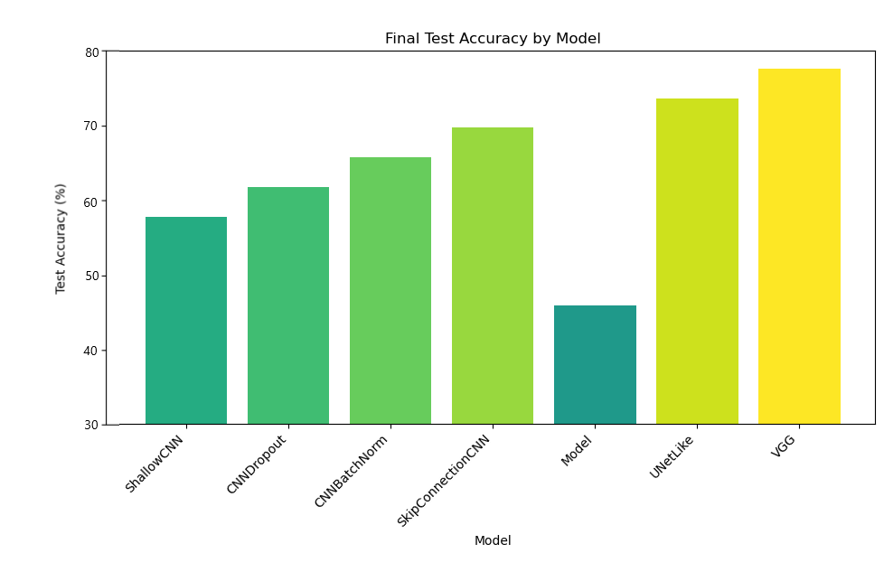
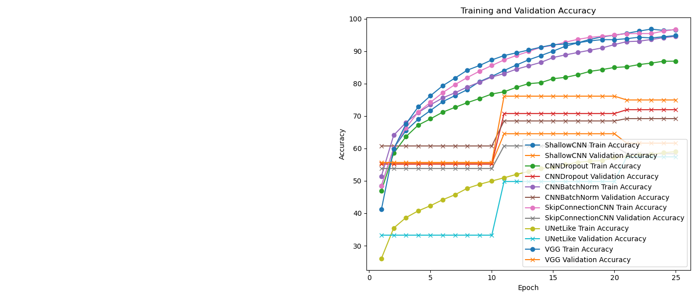
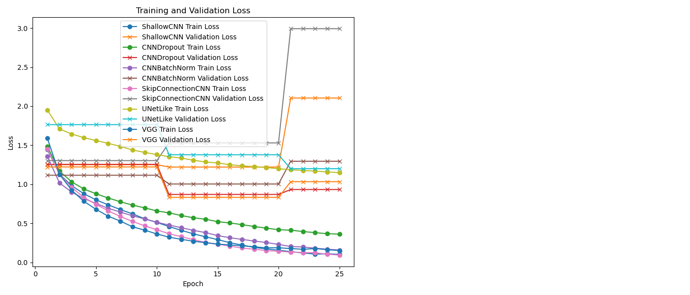
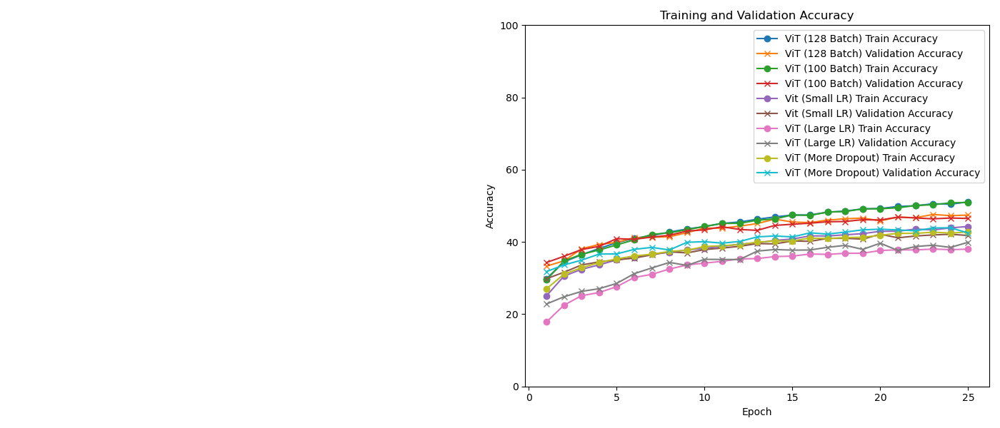
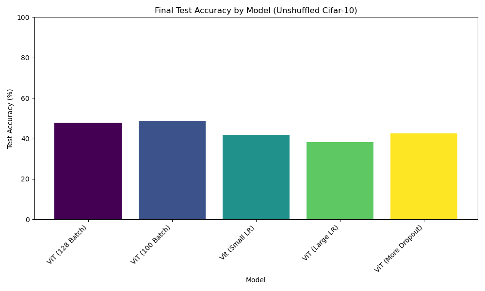

## Description
The python script main.py trains a model on CIFAR10 dataset using PyTorch. It allows you to specify the number of epochs, model_class, batch size, learning rate, and L2 regularization strength.

## Example Command
```python
python main.py --epochs 10 --model_class 'Plain-Old-CIFAR10' --batch_size 128 --learning_rate 0.01 --l2_regularization 0.0001
```

## Options
- epochs (int): Number of epochs for training (default: 100).
- model_class (str): Model class name. Choices - 'Plain-Old-CIFAR10','D-shuffletruffle','N-shuffletruffle'. (default: 'Plain-Old-CIFAR10')
- batch_size (int): Batch size for training (default: 128).
- learning_rate (float): Learning rate for the optimizer (default: 0.01).
- l2_regularization (float): L2 regularization strength (default: 0.0)


### Introduction


Our task was going into the depths of image transformations with a focus on deep learning techniques in terms of algorithms and the PyTorch library for addressing a hypothetical scenario with a vision of an alien species known as shuffletruffles. While they are the visionaries of mankind, that vision changes dramatically when they reach the age of 20. The requirement was then to develop models that will work smoothly with both normal and shuffled visual inputs using the CIFAR-10 dataset, which functions to represent the different visual capabilities of these aliens.


### Model Architectures
1. SimpleCNN: The design comprises three convolutional layers with depths of 32, 64, and 128 filters. The features in the image are captured by the layers, each layer being made up of various compositions and differing strides for the pooling strategy such that the spatial dimensions are reduced without losing out on the indispensable features. The architecture concludes with a fully connected layer for classifying results.
2. ShallowCNN: This is the simpler form with the output value and the speed of testing, and it consists of one convolutional layer with the patch size of 1x1x3, then max pooling with patch size of 2x2x2, and two fully connected layers with 120 neurons. This serves as the baseline model to evaluate the performance of more complex models.
3. Vision Transformer (ViT): The ViT model accomplishes image processing by using image input as fixed-size patches, which are linear embeddings through a series of transformer blocks with self-attention mechanisms to build an image understanding capability. Such a model, with its ability to capture global image dependencies, could better suit the challenge of images with a shuffled reality.
4. CNNDropout: It incorporates dropout layers after every convolutional layer in the CNNDropout model to fight against overfitting. This consists of two convolutional stages, followed by the dropout and fully connected layers, aimed at bringing out good results in over-parameter settings.
5. CNNBatchNorm: This corresponds to CNNDropout but focuses on improved training stability and speed. It applies batch normalization right after each of the convolutional layers in the CNNBatchNorm model to make it easier to converse the information back and forth during training.
6. SkipConnectionCNN: This type of model helps with the mitigation of the vanishing gradient problem via the use of connections between various blocks. It uses three convolutional layers with skip connections to increase the width and performance of the net without losing gradients.
7. VGG: This model is based on VGG architecture. We have sequential convolutional layers with 32 and 64 filtersfollowed by fully connected dense layers with ReLU activation. Dropout is also implemented.


### Best Performing Model:

Our best performing model for the original dataset was VGG with around 76% accuracy after 25 epochs.






### D-shuffletruffle:

Sinve ViT models operate on patches of the given image anyway, we modified the ViT model by randomizing the positional embeddings for every forward pass, thereby allowing the transformer model to learn the features of the images with shuffled patches rather than with ordered patches. This causes the performance of the model on the original test set to go down, but allows it to get the same performance for shuffled images. 

Our best performing model for the D-shuffletruffle dataset with 16x16 image patches was the modified ViT model with 16 patch size, we got 47.08% accuracy on the 16x16 patches and 48.32% on the original CIFAR-10 dataset. We tested the model with 25 epochs. We could have achieved higher accuracy if ran for more epochs but the time and computation power for that was not realistic to run for each experiment. The different models we tested for this consisted of differing parameters: 100 batch, 128 batch, Large learning rate (0.01), Small learning rate (0.0001), and More dropout (0.3). Our best model had 128 batch, 0.001 learning rate, and 0.1 dropout rate.





### N-shuffletruffle:

Our best performing model for the N-shuffletruffle dataset with 8x8 image patches was the modified ViT model with 8 patch size, we got 46.21% accuracy on the 8x8 patches and 47.86% on the original CIFAR-10 dataset. We tested the model with 25 epochs. We could have achieved higher accuracy if ran for more epochs but the time and computation power for that was not realistic to run for each experiment. The different models we tested for this consisted of differing parameters: 100 batch, 128 batch, Large learning rate (0.01), Small learning rate (0.0001), and More dropout (0.3). Our best model had 128 batch, 0.001 learning rate, and 0.1 dropout rate.




### Analysis

The following is a table comparing the test accuracy and loss of the 3 models for the three test sets:

Note: all models ran with epoch=15, batch_size=128, lr=0.001, l2_reg=0.0001 for the results

We created a new dataset consisting of 75 examples, which includes 25 examples from the original test set labelled 1 to 25, and their 16x16 and 8x8 shuffled patch counterparts with their corresponding labels. We then ran PCA using the final layer embeddings of each model with n_dim=2, and plotted the data points with colors as labels. There are 25 total labels, corresponding to 25 different colors in the plots.


We notice that for the PCA plot of the Net model, which gives bad performance in classifying shuffled images, the same colored points dont have a tendency to stay close together. There seems to be no sign of clustering in the plot either.

For the D-shuffletruffle and N-shuffletruffle plots, however, we notice that the same colored points tend to stick close to one another in the plot, indicating that the model is good at recognizing an image with it's shuffled counterpart. Interestingly, there are three clusters that seem to have formed for these plots, and the 25 data points are almost evenly split amongst the three clusters. 

Since LocalViT works very similarly to ViT in that it also takes as input image patches, it too may provide the same accuracy on both the original and their respective test set.


## Contributions
Sean: Creating and modifying ViT model, Analysis

Tyler: Creating CIFAR10 models and plots, D/N-shuffletruffle report

Shubh: Report introduction, LocalViT model (not pursued further)

